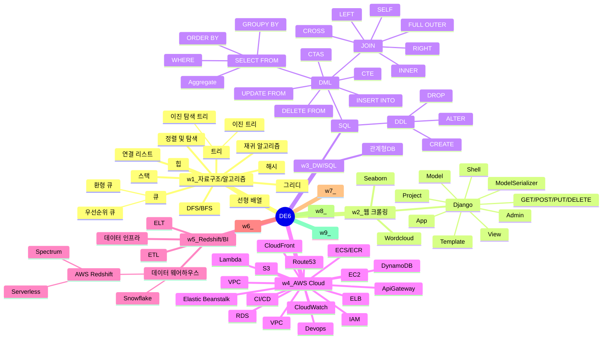

```mermaid
mindmap
  root((DE6))
    w1_자료구조/알고리즘
        선형 배열
        정렬 및 탐색
        재귀 알고리즘
        연결 리스트
        스택
        큐
            환형 큐
            우선순위 큐
        트리
            이진 트리
            이진 탐색 트리
        힙
        해시
        그리디
        DFS/BFS
    w2_웹 크롤링
        Seaborn
        Wordcloud
        Django
            Project
            App
            Model
            Admin
            Shell
            View
            Template
            ModelSerializer
            GET/POST/PUT/DELETE
    w3_DW/SQL
        관계형DB
        SQL
            DDL
                CREATE
                DROP
                ALTER
            DML
                SELECT FROM
                    WHERE
                    GROUPY BY
                    ORDER BY
                    Aggregate
                INSERT INTO
                UPDATE FROM
                DELETE FROM
                CTAS
                CTE
                JOIN
                    INNER
                    LEFT
                    RIGHT
                    FULL OUTER
                    SELF
                    CROSS
    w4_AWS Cloud
        EC2 
        Elastic Beanstalk
        DynamoDB
        Route53
        CloudFront
        ELB
        VPC
        IAM
        S3
        CI/CD
        VPC
        RDS
        Lambda
        ApiGateway
        CloudWatch
        Devops
        ECS/ECR
    w5_Redshift/BI
        ETL
        ELT
        데이터 웨어하우스
            AWS Redshift
                Spectrum
                Serverless
            Snowflake
        데이터 인프라
    w6_
        
        
    w7_
        
    w8_
        
    w9_
        
```